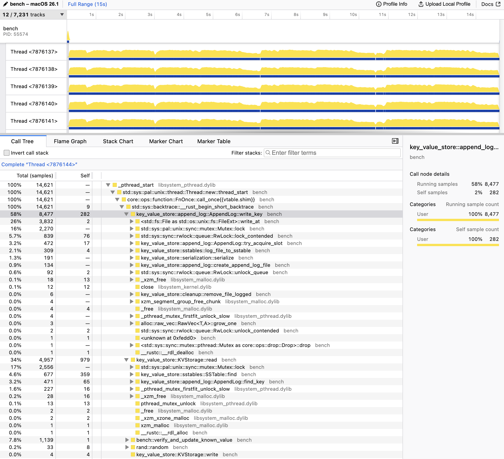

# Simple Key Value Persisted Store

## Features

- Insert a key 🔥
- Remove a key 🚀
- Read a key 😳

## Implementation

- Append-only log
- SSTables + In-memory Index + Bloom Filter
- Periodic SSTables compaction and merging
    - Includes Bloom filter rebuilding as they're per sstable
- Tombstone handling
- Multi-thread safety (UNIX only, uses `pwrite`)
- Deferred file deletion

## TODO

- [ ] Improve compaction logic
    - [ ] Add an option to slow down writes when it can't keep up
- [ ] Find faster deserializer
- [ ] Support loading existing database
- [ ] Add tests (!)
- [ ] Fix spaghetti code
- [ ] Add support for string values (easy)
- [ ] Add support for string keys (maybe harder)

## Performance

The chart below was generated using the following commands:

```
cd bench
cargo build --release
samply record ../target/release/bench
```

Please note that the benchmark should be improved to show performance metrics and to mirror real-world loads.

Anyway, you can see that a lot of time is spent waiting for locks, so that could probably be optimized. For example, one could have N log files (one per thread).


